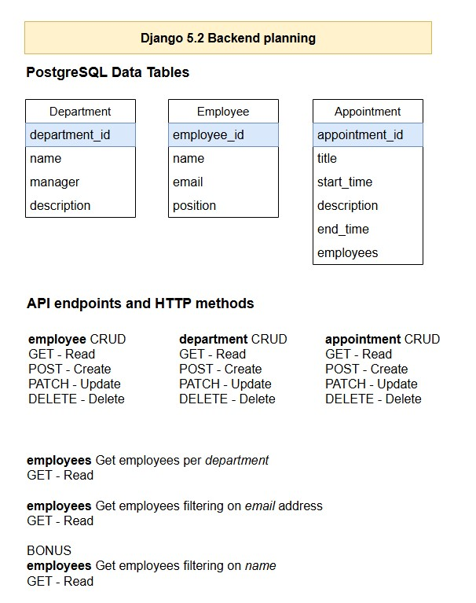
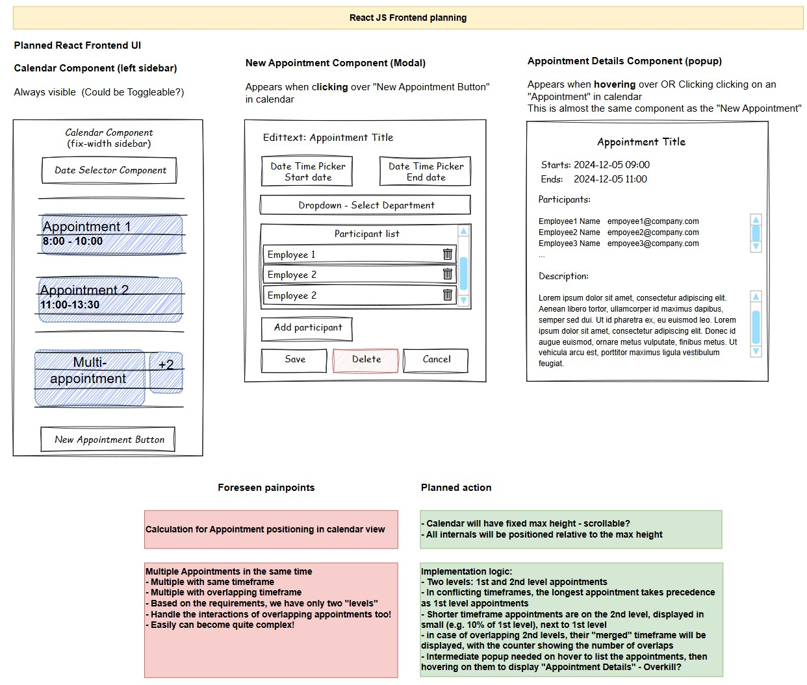

Fullstack sidebar calendar app with Django 5.2 backend and ReactJS frontend

    
    Prerequisites:
    -  Backend: 
       -  python 3.10+ venv
       -  Django 5.2 experimental installation (2024.11.18.)
       -  postgreSQL database with the following configuration:
             -  DATABASES = {
                'default': {
                'ENGINE': 'django.db.backends.postgresql',
                'NAME': 'calendar_db',
                'USER': 'postgres',
                'PASSWORD': 'qwert12345',
                'HOST': 'localhost',
                'PORT': '5432',
                }
              }
    -  Frontend:
       -  NodeJS 18+

 

---
Init Backend:

- start ps
- create postgeSQL db 
- Populate DB with data, OR
- restore the `calendar_db.sql`:
  - `pg_restore -U <username> -h <host> -d <target_database> calendar_db.sql`
- Run migrations:
  -  `python manage.py makemigrations`  
  -  `python manage.py migrate`

Init Frontend:
- install node modules:
  - `cd frontend`
  - `npm install`

---
Launch app (BE + FE):
- `cd calendar-app  `
- `./utils/start_app.sh`

Or one by one:

Backend:
- `cd backend`
- `python manage.py runserver 127.0.0.1:5000`

Frontend:
- `cd frontend`
- `npm run start`

-----

Development time allocation:
- Design:
  - Backend: 1 hour
  - Frontend: 1 hour
- Backend:
  - Backend init: 2 hours (Django 5.2, CORS)
  - Apps setup, views, migration, api urls: 3 hours
- Frontend:
  - Frontend init: 0.5 hour
  - Main calendar component implementation: 3 hours
  - Appointment modal implementation: 2.5 hours
- Documentation:
  - 1.5 hours

---
The following plans served as the basis of the implementation:

